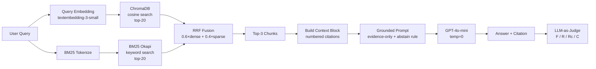

# Architecture — RAG Pipeline (Day 08 Lab)
**Thành viên thực hiện:**
- `2A202600503` — Võ Thanh Danh
- `2A202600502` — Trương Hầu Minh Kiệt

**Ngày:** 2026-04-13

## 1. Tổng quan kiến trúc

Hệ thống là **trợ lý nội bộ CS + IT Helpdesk** giúp nhân viên tra cứu chính sách hoàn tiền, SLA ticket, quy trình cấp quyền và FAQ kỹ thuật từ 5 tài liệu nội bộ. Pipeline RAG đảm bảo câu trả lời luôn có trích dẫn nguồn, không tự bịa thông tin ngoài tài liệu.

```
[Raw Docs (.txt)] ×5
    ↓
[index.py]
  Preprocess → Header extract → Section-based chunking → Embed → ChromaDB
    ↓
[ChromaDB Vector Store — cosine similarity]
    ↓
[rag_answer.py]
  Query → Dense (+ BM25) → RRF Fusion → Top-3 → Grounded Prompt → LLM
    ↓
[Answer + Citation [1][2] + Sources]
    ↓
[eval.py]
  LLM-as-Judge → Scorecard (F/R/Rc/C) → A/B Comparison
```

---

## 2. Indexing Pipeline (Sprint 1)

### Tài liệu được index

| File | Nguồn (source metadata) | Department | Số chunk (ước tính) |
|------|------------------------|-----------|---------------------|
| `policy_refund_v4.txt` | policy/refund-v4.pdf | CS | ~6 |
| `sla_p1_2026.txt` | support/sla-p1-2026.pdf | IT | ~5 |
| `access_control_sop.txt` | it/access-control-sop.md | IT Security | ~7 |
| `it_helpdesk_faq.txt` | support/helpdesk-faq.md | IT | ~6 |
| `hr_leave_policy.txt` | hr/leave-policy-2026.pdf | HR | ~5 |

### Quyết định chunking

| Tham số | Giá trị | Lý do |
|---------|---------|-------|
| Chunk size | 400 tokens (~1600 chars) | Đủ chứa 1 điều khoản hoàn chỉnh; chunk lớn hơn gây "lost in the middle" |
| Overlap | 80 tokens (~320 chars) | Giữ ngữ cảnh khi điều khoản bị split qua 2 chunk |
| Chunking strategy | **Section-heading first**, rồi paragraph-split nếu section quá dài | Tài liệu có cấu trúc rõ ràng `=== Section ===`; cắt theo section tránh tách đôi điều khoản liên quan |
| Metadata fields | `source`, `section`, `department`, `effective_date`, `access` | `source` cho citation; `section` cho filter; `effective_date` cho freshness; `department` cho routing |

**Chunking strategy detail:**
1. Split text theo pattern `=== ... ===` → các section riêng biệt
2. Mỗi section nếu ≤ 1600 chars → 1 chunk
3. Section dài hơn → paragraph-split với overlap 320 chars từ chunk trước

### Embedding model

- **Model**: `text-embedding-3-small` (OpenAI) — 1536 dims, hỗ trợ tiếng Việt tốt
- **Fallback**: `paraphrase-multilingual-MiniLM-L12-v2` (Sentence Transformers local)
- **Vector store**: ChromaDB PersistentClient
- **Similarity metric**: Cosine

---

## 3. Retrieval Pipeline (Sprint 2 + 3)

### Baseline (Sprint 2) — Dense

| Tham số | Giá trị |
|---------|---------|
| Strategy | Dense (embedding cosine similarity) |
| Top-k search | 10 |
| Top-k select | 3 |
| Rerank | Không |

### Variant (Sprint 3) — Hybrid (Dense + BM25 + RRF)

| Tham số | Giá trị | Thay đổi so với baseline |
|---------|---------|------------------------|
| Strategy | **Hybrid (Dense + BM25/RRF)** | Dense → Dense + BM25 fusion |
| Dense weight | 0.6 | — |
| Sparse weight | 0.4 | — |
| RRF k constant | 60 (tiêu chuẩn) | — |
| Top-k search | 10 | Không đổi |
| Top-k select | 3 | Không đổi |
| Rerank | Không | Không đổi |

**Lý do chọn Hybrid (A/B Rule: chỉ đổi 1 biến — retrieval_mode):**

Corpus có 2 loại content:
1. **Ngôn ngữ tự nhiên**: policy điều khoản hoàn tiền, HR leave policy → Dense mạnh
2. **Exact keyword**: `P1`, `Level 3`, `ERR-403`, `Approval Matrix` (tên cũ của access-control-sop) → Dense yếu, BM25 mạnh

Query `"Approval Matrix để cấp quyền"` → Dense có thể bỏ qua vì embedding của "Approval Matrix" khác "Access Control SOP". BM25 match exact term. RRF kết hợp cả hai signal mà không cần normalize score.

**RRF formula:**
```
RRF_score(doc) = 0.6 / (60 + dense_rank) + 0.4 / (60 + sparse_rank)
```

---

## 4. Generation (Sprint 2)

### Grounded Prompt Template

```
Answer only from the retrieved context below.
If the context is insufficient to answer the question, explicitly say
"Không đủ dữ liệu trong tài liệu để trả lời câu hỏi này." and do not
make up any information.
Cite the source number in brackets like [1] or [2] when referencing information.
Keep your answer short, clear, and factual.
Respond in the same language as the question.

Question: {query}

Context:
[1] {source} | {section} | score={score}
{chunk_text}

[2] ...

Answer:
```

**4 quy tắc prompt:**
1. **Evidence-only**: chỉ dùng retrieved context
2. **Abstain**: "Không đủ dữ liệu..." khi thiếu context
3. **Citation**: `[1]`, `[2]` khi trích dẫn
4. **Short, clear**: ngắn gọn, temperature=0

### LLM Configuration

| Tham số | Giá trị |
|---------|---------|
| Model | `gpt-4o-mini` |
| Temperature | 0 (output ổn định cho eval) |
| Max tokens | 512 |
| Provider fallback | Google Gemini 1.5 Flash |

---

## 5. Evaluation (Sprint 4)

### LLM-as-Judge (Bonus)

Thay vì chấm thủ công, dùng `gpt-4o-mini` làm judge cho 3/4 metrics:

| Metric | Cách chấm | Thang |
|--------|-----------|-------|
| Faithfulness | LLM judge: answer grounded in context? | 1-5 |
| Answer Relevance | LLM judge: answer relevant to query? | 1-5 |
| Context Recall | Rule-based: expected sources retrieved? | 0-5 |
| Completeness | LLM judge: answer covers expected points? | 1-5 |

---

## 6. Failure Mode Checklist

| Failure Mode | Triệu chứng | Cách kiểm tra |
|-------------|-------------|---------------|
| Index lỗi | Retrieve về docs cũ / metadata thiếu | `inspect_metadata_coverage()` |
| Chunking tệ | Chunk cắt giữa điều khoản | `list_chunks()` — đọc text preview |
| Dense miss keyword | Bỏ lỡ alias/exact term (e.g. "Approval Matrix") | So sánh dense vs hybrid recall |
| Generation hallucinate | Answer có thông tin ngoài context | `score_faithfulness()` < 3 |
| Token overload | Context block quá dài | Kiểm tra độ dài context (max 3 chunks × 1600 chars) |
| Abstain fail | Model tự bịa khi không có context | Test query "ERR-403-AUTH" |

---

## 7. Pipeline Diagram (Mermaid)


